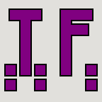
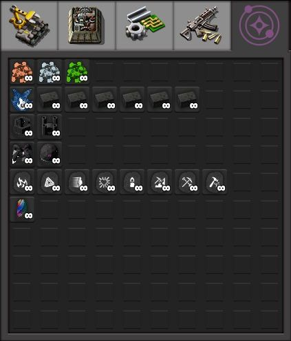
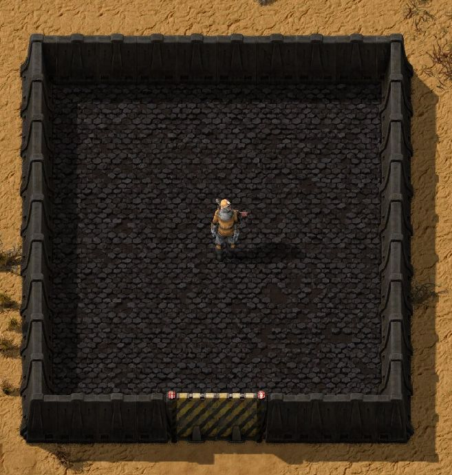
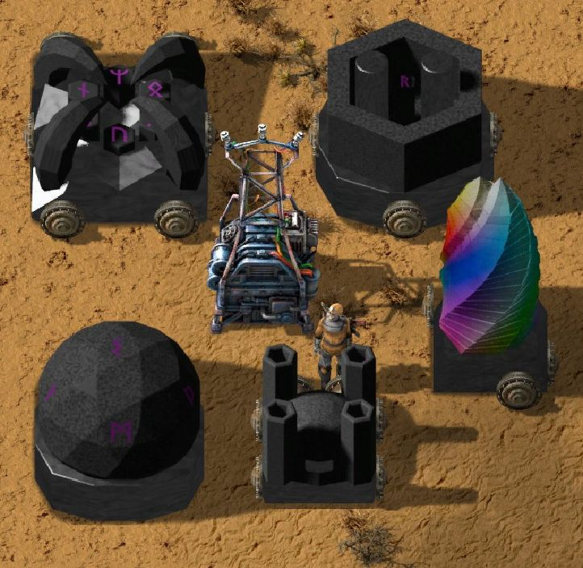
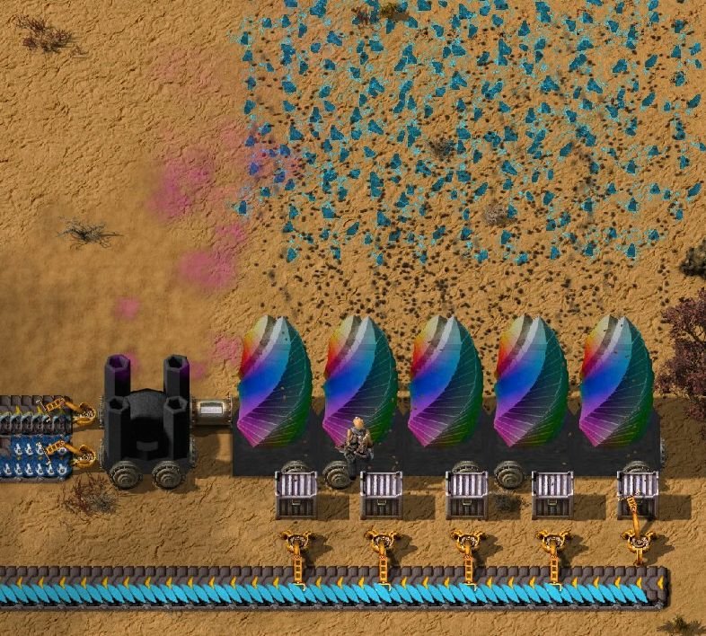
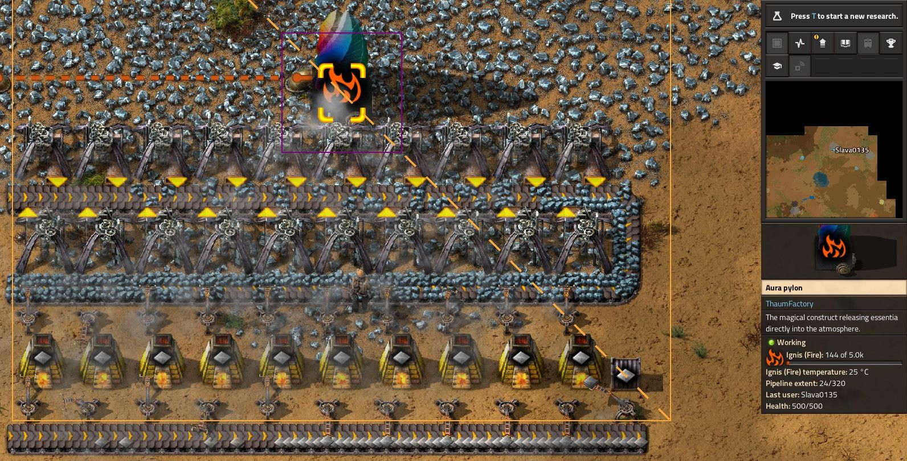
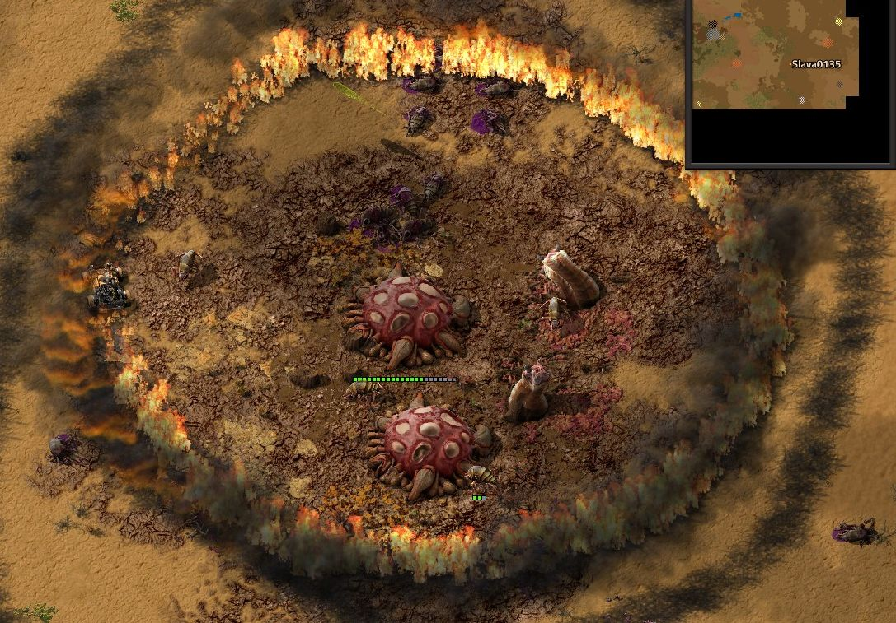
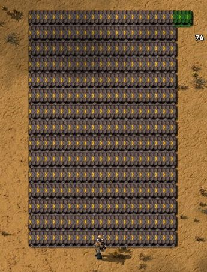

# ThaumFactory

**ThaumFactory** is mod for **Factorio** about drawing magic from physical objects and reshaping it to perform miracles.

> **Note: mod is still in development and has not reached version 1.0 yet**. Some features are missing or not done, art is not finished and balance may be off. Have fun playing regardless!

## Features

- Find and mine shards of **6 primal aspects** that can be used to craft new items and buildings.
- Turn items into liquid **aspects** (**40 total**) that can be used to create new powerful materials, tools and buildings.
  - **Air, Earth, Fire, Water, Order, Entropy, Ice, Light, Motion...** We have them all! *(well, almost!)*
- **Runestones**: powerful passive items that can grant player special modifiers.
  - **Fire runestone**: get fire immunity and leave fire trail behind you.
  - **Motion runestone**: get massive speed boost.
  - **Craft runestone**: increase crafting speed and repair stuff around you.
  - Mine runestone: mine faster and further **(including buildings!)*
  - *and more...*
- **Aura pylon**: machines that diffuse essentia, each triggering a distinct phenomenon.
  - Plant aspect: create trees around.
  - Fire aspect: power solid fuel machinery, including furnaces and boilers.
  - Mine aspect: mine rocks and ores.
  - Earth aspect: create rocks from nothing.
  - *and more...*
- Create *native clusters* from ores for **double ore output**.
- Cool looking **dark walls and paths** made from arcane stone.
- *and more...*

## Contributing

We are happy to accept contributions from 3D artists, 2D artists, programmers, sound designers, translators - *anyone*!

Check [contribution guidelines](./docs/CONTRIBUTING.md) to start!

## Credits

*Inspired by original mod Thaumcraft by Azanor13 for Minecraft.*

Most assets are licensed under **CC-BY-SA**.

Code is licensed under [MIT](./LICENSE).

Check *attribution files* for more info: [**Graphics**](./graphics/attributions.md), [**Sound**](./sounds/attributions.md), [**Localization**](./locale/attributions.md).

>3D models with attributions are uploaded in archive for each release on "Releases" page.

*Extra credit to Krastorio 2 team for making useful reference mod!*

## Showcase

### Buildings

Better walls and paths from darker stone version.

Various buildings for manipulating aspects and crafting magic items.

Use essentia for various tasks like mining or powering furnaces.

### Runes

From spawning fire under your feet to increasing your building range - runes can be very useful and fun!

